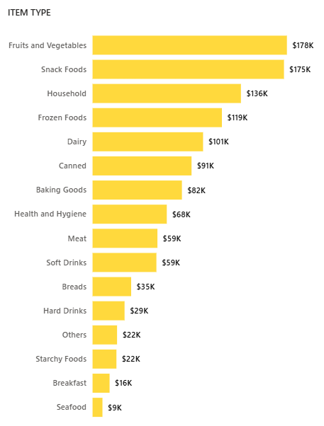

# Blinkit Sales Analysis Dashboard 📊

### Table of Contents

1.  Project Overview
2.  Data Source
3.  Key Metrics (KPIs)
4.  Dashboard Visualizations
5.  Dashboard Highlights
6.  Technical Details
7.  Future Enhancements
8.  Repository Contents
9.  How to Use
10. Author

---

### Project Overview 🚀

The primary objective of this project is to conduct a detailed analysis of Blinkit's sales performance, customer satisfaction, and inventory distribution. The goal is to identify actionable insights and optimization opportunities by leveraging various Key Performance Indicators (KPIs) and data visualizations in Power BI.

### Data Source 📁

The analysis is based on the following dataset:

* `BlinkIT Grocery Data.xlsx`: This Excel file contains the raw data used to create the Power BI dashboard, including details on sales, items, outlets, and customer ratings.

### Key Metrics (KPIs) 📈

The following Key Performance Indicators (KPIs) were used to measure performance:

1.  **Total Sales:** The overall revenue generated from all items sold.
2.  **Average Sales:** The average revenue per sale.
3.  **Number of Items:** The total count of different items sold.
4.  **Average Rating:** The average customer rating for items sold.

### Dashboard Visualizations 🎨

The dashboard is composed of several interactive charts and visualizations, each designed to answer specific business questions. Below is a breakdown of the charts and their objectives. You should add a screenshot for each chart to visually represent the analysis.

* **Total Sales by Fat Content:** A Donut Chart is used to analyze the impact of fat content on total sales.
    

* **Total Sales by Item Type:** A Bar Chart is used to identify the performance of different item types in terms of total sales.
    

* **Fat Content by Outlet for Total Sales:** A Stacked Column Chart is used to compare total sales across different outlets, segmented by fat content.
    

* **Total Sales by Outlet Establishment:** A Line Chart is used to evaluate how the age or type of outlet establishment influences total sales.
    

* **Sales by Outlet Size:** A Donut Chart is used to analyze the correlation between outlet size and total sales.
    

* **Sales by Outlet Location:** A Funnel Map is used to assess the geographic distribution of sales across different locations.
    

* **All Metrics by Outlet Type:** A Matrix Card provides a comprehensive view of all key metrics (Total Sales, Average Sales, Number of Items, Average Rating) broken down by different outlet types.
    

### Dashboard Highlights ✨

This section highlights the most important features and insights of the dashboard, giving a quick overview of its capabilities.

* **Key Performance Indicators (KPIs):** The top section of the dashboard prominently displays the main KPIs, including Total Sales, Average Sales, Number of Items, and Average Rating, giving a quick snapshot of the overall performance.
    

* **Filter Panel:** The interactive filter panel on the left allows users to dynamically explore the data by Outlet Location Type, Outlet Size, and Item Type.
    

### Technical Details ⚙️

The Power BI file `blinkit_analysis.pbix` leverages the following technical components:

* **Data Transformation:** Power Query was used to clean and shape the raw data for analysis.
* **Data Modeling:** The data is structured with a star schema to optimize performance and relationships between tables.
* **DAX Measures:** Several DAX (Data Analysis Expressions) measures were created to calculate key metrics such as Total Sales and Average Sales.

### Repository Contents 📦

This repository includes the following key files and folders:

* `blinkit_analysis.pbix`: The Power BI Desktop file containing the complete data model, transformations, and dashboard visualizations.
* `BlinkIT Grocery Data.xlsx`: The raw data file used as the source for the analysis.
* `screenshots/`: A directory where you should place all dashboard screenshots as mentioned above.

### How to Use 📖

1.  Clone this repository to your local machine.
2.  Ensure you have **Power BI Desktop** installed.
3.  Open the `blinkit_analysis.pbix` file using Power BI Desktop to view and interact with the dashboard.
4.  You can also inspect the data and data model within Power BI.

---

### Author 👨‍💻

* **Shantanu Chaturvedi**
